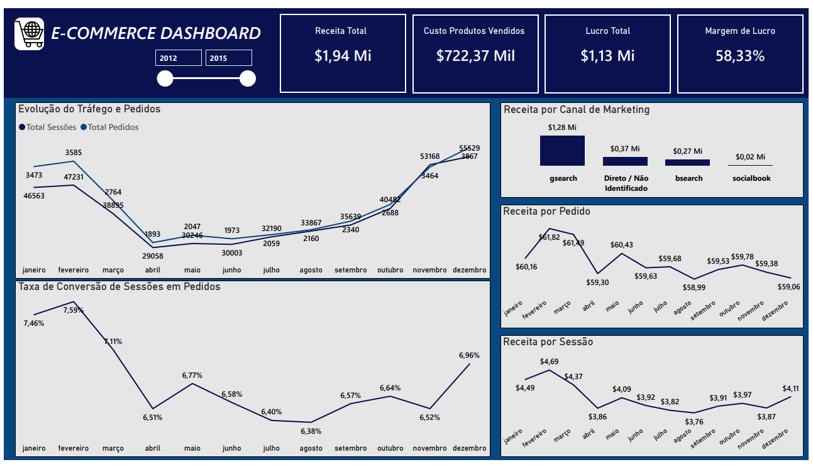

# 📊 Dashboard de E-Commerce – Power BI

## 🎯 Objetivo
Analisar o desempenho de um e-commerce fictício (Maven Fuzzy Factory) utilizando um dataset público com dados de tráfego, pedidos e marketing digital, com foco em tendências de acesso, conversão, receita e performance dos canais de marketing ao longo do tempo.

Este dashboard foi desenvolvido com o objetivo de simular análises comuns realizadas no dia a dia de um Analista de Dados / Analista de BI, apoiando a tomada de decisão baseada em dados.

---

## 🧰 Ferramentas Utilizadas
- Power BI
- DAX
- Excel / CSV (dataset público)

---

## 🧹 Preparação de Dados e Modelagem
- Limpeza e organização dos dados (tratamento de valores nulos e padronização de campos)
- Criação de medidas em DAX para cálculo de métricas de negócio
- Modelagem de dados com foco na análise de conversão, receita e lucratividade

---

## 📈 Principais Métricas
- Receita Total
- Custo dos Produtos Vendidos (CPV)
- Lucro Total
- Margem de Lucro %
- Total de Sessões
- Total de Pedidos
- Taxa de Conversão de Sessões em Pedidos
- Receita por Sessão
- Receita por Pedido - Ticket Médio

---

## 📊 Análises Realizadas
- Evolução do volume de tráfego (sessões) e de pedidos ao longo do tempo 
- Tendência da taxa de conversão de sessões em pedidos
- Evolução da receita por sessão
- Evolução do ticket médio (receita por pedido) 
- Comparação de receita por canal de marketing 

---

## 📌 Destaques do Dashboard
- Identificação de tendências mensais de tráfego e vendas
- Avaliação da eficiência dos canais de marketing
- Análise de rentabilidade considerando custo (CPV) e lucro 
- Visão clara da relação entre tráfego, conversão e receita

---

## 🖼️ Dashboard

---

## 📂 Arquivos Disponíveis
- 📄 [Dashboard em PDF](Analise_Ecommerce_Portfolio_Portugues.pdf)

> ℹ️ O arquivo .pbix não foi incluído no repositório devido ao tamanho elevado do dataset.
